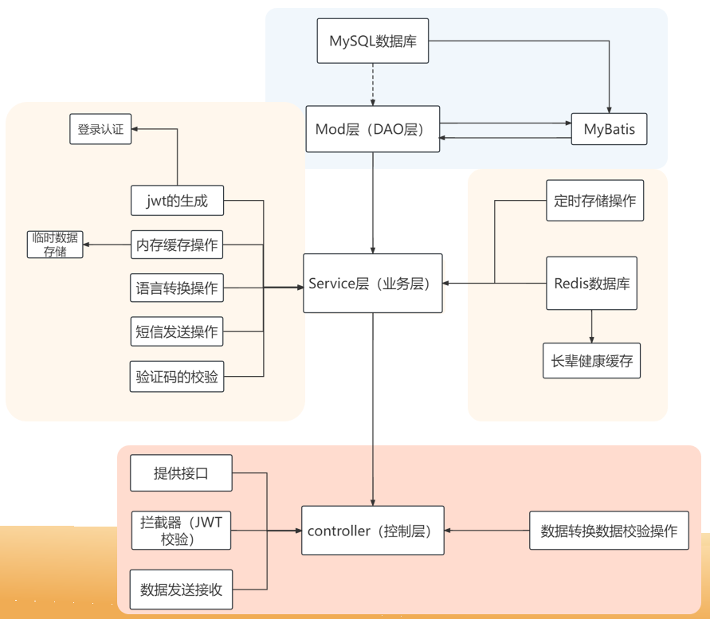

# E守护的后端

## 介绍
e-守护 数字时代多样化养老服务平台-后端代码

### 项目地址
1. 后端：
- Gitee: https://gitee.com/mohaos/backend-of-e-guard
- GitHub: https://github.com/mohao1/E-GuardedBackend
2. 后台管理系统-前端：
- Gitee: https://gitee.com/mohaos/e-shouhu-UI
- GitHub: https://github.com/mohao1/E-GuardianBackendManagement-System--FrontEnd-

## 软件架构
### 软件架构：
1. 开发环境IDEA
2. Java版本：java-11。
3. SpringBoot版本：SpringBoot2.7.9。 
4. MySQL版本：MySQL5.7。 
5. Maven版本：Maven5
6. 其它技术：
Redis、Mybatis、腾讯云短信、腾讯云COS桶存储、Socket编程、高德定位技术、百度智能语音转换。

### 功能设计:

## 安装教程

1. 配置好MySQL数据库和MySQL数据库的连接。
2. 配置好Redis数据库的连接。
3. 设置好第三方服务需要的信息在Utils.Cons中进行数据的配置。
4. 启动项目。

## 功能介绍

1.  长辈、晚辈、社区、社区管理人员、系统管理人员、后台系统。
2.  长辈：定位、签到、步数、个人健康信息、紧急呼救、信息发送、社区管理、家庭管理、个人信息、药品记录提醒、备忘录、语音转换、反诈宣传。
3.  晚辈：查看长辈定位、家庭管理、长辈健康信息、长辈步数、信息发送、药品设置
4.  社区：社区长辈管理、社区长辈状态、长辈定位、长辈健康信息、消息发送。
5.  社区管理人员：社区人员管理、长辈管理、消息接收发送。 
6.  后台系统：各个长辈的健康信息统计、呼救统计、活动统计、长辈健康数据分析、活跃用户数据分析、社区信息、社区管理、反诈设置。

